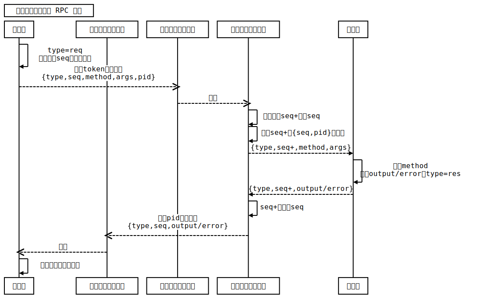
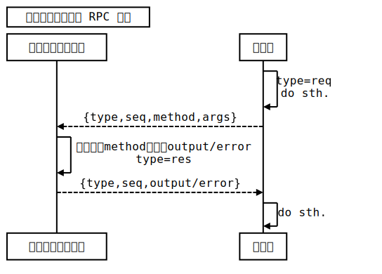

# 功能
主要功能：供评测机使用 WebSocket 连接控制端；负责确认、管理、评测机的状态并汇报给其他模块；与评测机通信：包括分发任务、接受任务回报、控制评测机行为、强制使评测机下线；记录评测机所分配到的任务，并在评测机下线时重新分配未完成的任务。

# 细节/特性
## 评测机状态
评测机 / Token 共有四状态：

<pre hidden>
graph TD
    ST[START]-->|http获取token|A
    A[*Unused]-->|评测机登录|B[*Online]
    B-->|RPC:Exit间接调用|RJ[removeJudger]
    B-->|直接调用|RJ
    RJ-->C[*Disabled]
    C-->Ca[禁止分发任务]
    C-->|WebSocket断开|D[*Closed]
    D-->Da[重新分配未完成任务]
    D-->|一段时间后|Db[清理记录]
    Db-->ED[END]
</pre>


- Unused 未使用
- Online 在线：可以为评测机分发任务，评测机可以回报任务状态/结果。
- Disabled 禁用：**不**可以为评测机分发任务，评测机可以回报任务状态/结果。
- Closed 下线：应当为重新分配其未完成的任务（可能为意外断开）。

> 只要 WebSocket 连接未断开（Online、Disabled），评测机应当每隔一段时间发送自身状态，也当作“心跳”。

## 通信
配合多线程，实现了基于 WebSocket 实现的双向 RPC。

每个进程监听一个redis中属于该进程的消息队列。每个WebSocket连接监听一个属于该连接的消息队列。

### 控制端调用评测机的方法
<pre hidden>
Title: 控制端调用评测机 RPC 方法
participant 某进程
participant 某进程的消息队列
participant 评测机的消息队列
participant 评测机连接的进程
participant 评测机
某进程->某进程: type=req\n生成唯一seq，设置超时
某进程-->>评测机的消息队列: 根据token塞入队列\n{type,seq,method,args,pid}
评测机的消息队列-->>评测机连接的进程: 取出
评测机连接的进程->评测机连接的进程: 生成唯一seq+替换seq
评测机连接的进程->评测机连接的进程: 记录seq+和{seq,pid}的映射
评测机连接的进程-->评测机: {type,seq+,method,args}
评测机->评测机: 调用method\n得到output/error，type=res
评测机-->评测机连接的进程: {type,seq+,output/error}
评测机连接的进程->评测机连接的进程: seq+替换为seq
评测机连接的进程-->>某进程的消息队列: 根据pid塞入队列\n{type,seq,output/error}
某进程的消息队列-->>某进程: 取出
某进程->某进程: 返回结果，取消超时
</pre>



<pre hidden>
Title: 评测机调用控制端 RPC 方法
participant 评测机连接的进程
participant 评测机
评测机->评测机: type=req\ndo sth.
评测机-->评测机连接的进程: {type,seq,method,args}
评测机连接的进程->评测机连接的进程: 调用相应method，得到output/error\ntype=res
评测机连接的进程-->评测机: {type,seq,output/error}
评测机->评测机: do sth.
</pre>


## redis 键含义
```js
export const SendMessageQueueSuf = ":WsPendingMeaaage"; // list 评测机的消息队列的后缀
export const ResQueueSuf = ":ProcessRes"; // list 进程的消息队列的后缀

export const ProcessLife = "ProcessLife"; // hash 进程心跳记录
export const ProcessOwnWsSuf = ":ProcessWs"; // set 进程拥有的评测机
export const WsOwnTaskSuf = ":WsTask"; // set 评测机拥有的任务

export const AllToken = "AllToken"; // hash 所有的 token 的基础信息（如容量、name）
export const AllReport = "JudgerReport"; // hash 评测机的状态报告
export const JudgerLogSuf = ":JudgerLog"; // list 评测机的 Log 的后缀

// 记录 token 转为此状态时的 timestamp
export const UnusedToken = "UnusedToken"; // hash 
export const OnlineToken = "OnlineToken"; // hash
export const DisabledToken = "DisablesToken"; // hash
export const ClosedToken = "ClosedToken"; // hash

export const WsTaskLockSuf = ":WsTaskLock"; // expire string 评测机任务重新分配时的临时锁，防止任务被重新分配多次
```

## 设置项含义
webSocketPath：评测机连接的 Path

tokenExpire：token生成后的有效期

listenTimeoutSec：redis 阻塞监听的 timeout （秒）

reportInterval：默认评测机心跳间隔（实际的心跳间隔必须小于这个值）

lifeCheckInterval：每隔多久检测一次评测机是否定期发送了心跳

tokenGcInterval：多久清理一次 token 记录

tokenGcExpire：token 转为 Closed 后多久会被清理

processPingInterval：进程心跳间隔

processCheckInterval：多久检测一次其他进程是否存活

flexibleTime：评测机/进程可能按时心跳了，但是记录心跳需要一定的时间，可能检测心跳时还在记录心跳，所有设置这个冗余时间

rpcTimeout：RPC 调用的 timeout

# Tips
- 为 nginx 代理转发添加 header，用于检测 ip。
```properties
location /v1 {
    proxy_pass http://....;
    # proxy_set_header X-Real-IP $remote_addr;
    proxy_set_header X-Forwarded-For $proxy_add_x_forwarded_for;
}
```

# 外部系统引入
`src/judger/judger.service.ts`中搜索关键字“外部”，填充相应内容，包括：任务状态回报、任务结果回报、设置 redis 中任务详细信息所在的键名。

并清理相应注释。

# 异常排查
- redis 里有无法自动清理的 Disabled 记录。
  只有调用 removeJudger 时才会添加 Disabled 记录。虽然上文说到 removeJudger 会被调用多次，但是最终清理某 token 时会删除该 token 的 Disabled 记录。又由于 removeJudger 不检测 token 是否真实存在，因此你可能在调用 removeJudger 时传入了错误/失效已久的 token。
- Log中出现大量`callRecord 记录丢失`、`回报无效任务结果 xx 个`
  系统负载过高。
- 测试的时候其他主机的评测机连不上控制端
  将配置文件中`hostname`改为 `0.0.0.0`。
- 测试用评测机脚本
```ts
import WebSocket from "ws";
import axios, { AxiosResponse } from "axios";
import crypto from "crypto";

let status: { id: string; state: string }[] = [];
let result: { id: string; result: any }[] = [];

axios
    .get("http://127.0.0.1:8080/v1/judger/token", {
        data: {
            maxTaskCount: 50,
            name: "judger" + crypto.randomBytes(2).toString("hex")
        }
    })
    .then((e: AxiosResponse) => {
        console.log(e.data["token"]);
        const ws = new WebSocket(
            `http://127.0.0.1:8080/v1/judger/websocket?token=${e.data["token"]}`
        );
        ws.on("open", function open() {
            setInterval(() => {
                ws.send(
                    JSON.stringify({
                        type: "req",
                        seq: 1,
                        body: {
                            method: "ReportStatus",
                            args: { cpu: 100 }
                        }
                    })
                );
            }, 1000);
        });
        ws.on("error", e => {
            console.log(e);
            console.log("err");
        });
        ws.on("close", (e, r) => {
            console.log(e, r);
            process.exit();
        });
        ws.on("message", (s: string) => {
            console.log(s);
            const data = JSON.parse(s);
            if (data.type === "res") return;
            if (data.body.method == "CreateJudge") {
                const id = data.body.args.id;
                setTimeout(async () => {
                    status.push({ id, state: "Judging" });
                    setTimeout(async () => {
                        result.push({
                            id,
                            result: {
                                result: {
                                    res: "ac"
                                }
                            }
                        });
                    }, 900);
                }, 100);
            }
            ws.send(
                JSON.stringify({
                    seq: data.seq,
                    type: "res",
                    body: { output: null }
                })
            );
        });
        setInterval(() => {
            if (status.length !== 0) {
                ws.send(
                    JSON.stringify({
                        seq: 100,
                        type: "req",
                        body: {
                            method: "UpdateJudges",
                            args: status.splice(0)
                        }
                    })
                );
            }
        }, 1000);

        setInterval(() => {
            if (result.length !== 0) {
                ws.send(
                    JSON.stringify({
                        seq: 100,
                        type: "req",
                        body: {
                            method: "FinishJudges",
                            args: result.splice(0)
                        }
                    })
                );
            }
        }, 1000);
    });
```